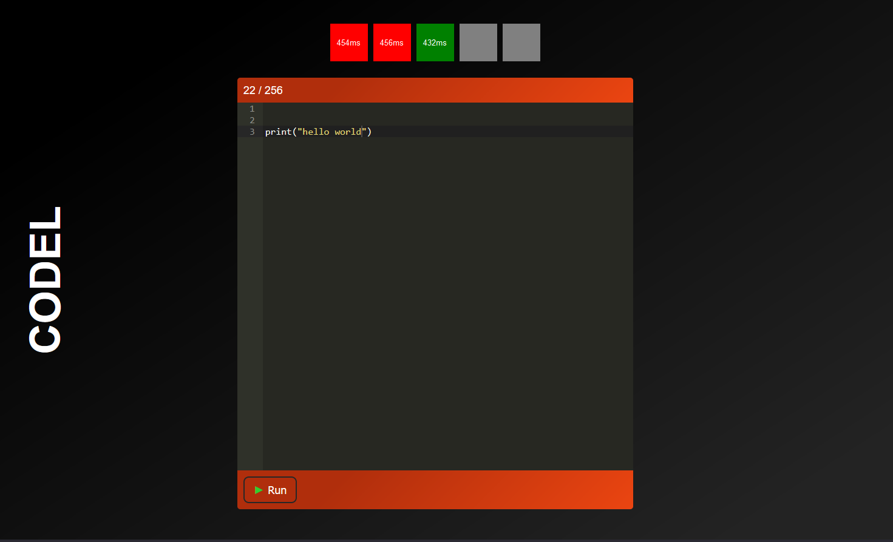

# Codel: Wordle but with Code

Know too many programming languages? I don't, but if you do, take a try to guess the language!

## Table of Contents

- [Codel: Wordle but with Code](#codel-wordle-but-with-code)
  - [Table of Contents](#table-of-contents)
  - [Overview](#overview)
  - [Technologies](#technologies)
  - [Getting Started](#getting-started)
  - [Usage](#usage)

## Overview

This is a wordle clone with a twist: print "Hello World" in a completely unknown language! You have 5 guesses to get it right. If you don't, you can always try again.



## Technologies

This project is created with:

- [Flask](https://flask.palletsprojects.com/en/2.0.x/): 2.0.2
- [Piston API](https://github.com/engineer-man/piston): v2
- [Waitress](https://docs.pylonsproject.org/projects/waitress/en/stable/): 2.1.2
- [Twimoji](https://github.com/twitter/twemoji)
- [SVG Spinners](https://github.com/n3r4zzurr0/svg-spinners)
  
## Getting Started

This repo just makes sick badges, but for most repos, use the following:

Clone the Repo \
```git clone https://github.com/Pop101/Codel``` \
Enter the repo and Install requirements \
```cd Codel && sudo python3 -m pip install -r requirements```

Launch the webserver \
```python3 webserver.py```

## Usage

Just connect to the webserver and start guessing! \
```http://localhost:8484```
